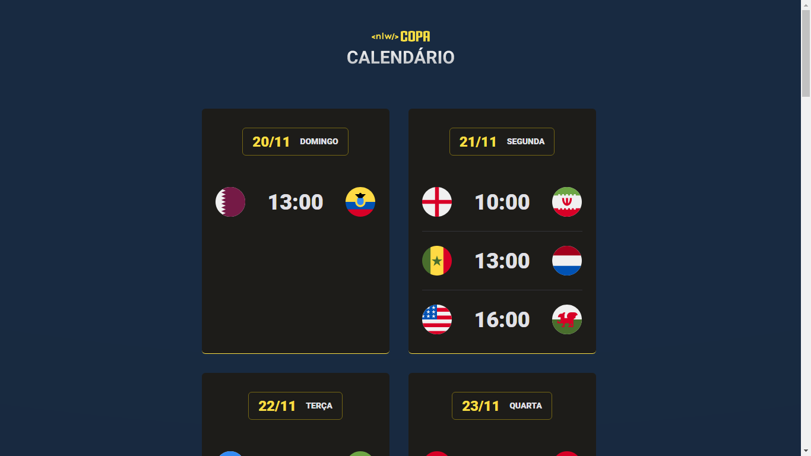

# NLW-Copa-Explorer

 Evento exclusivo e gratuito, promovido pela Rocketseat para ensino de tecnologias WEB.

 
  <a href="#-tecnologias">Tecnologias</a>&nsbp;&nsbp;&nsbp; | &nsbp;&nsbp;&nsbp;
  <a href="#-projeto">Projeto</a>&nsbp;&nsbp;&nsbp; | &nsbp;&nsbp;&nsbp;
  <a href="#-layout">Layout</a>&nsbp;&nsbp;&nsbp; | &nsbp;&nsbp;&nsbp;
  <a href="#memo-licença">Licença</a>

> Trilha Explorer

Projeto construído do evento Next Level Week da Rocketseat.

[🔗 Clique aqui para acessar](https://maykbrito.github.io/nlw-esports-explorer/)

## 🛠 Tecnologias

- HTML
- CSS
- Git e Github

## 💛 Contato

maykbrito@gmail.com